# SOC104 - Malware Detected

## 🧭 1. Alert Details

* EventID : 14
* Event Time : **Sep, 15, 2020, 09:02 PM**
* Source Address : **172.16.17.82**
* Source Hostname : **JohnComputer**
* File Name : _**googleupdate.exe**_
* File Hash : **0bca3f16dd527b4150648ec1e36cb22a**
* Device Action : **Allowed**

<figure>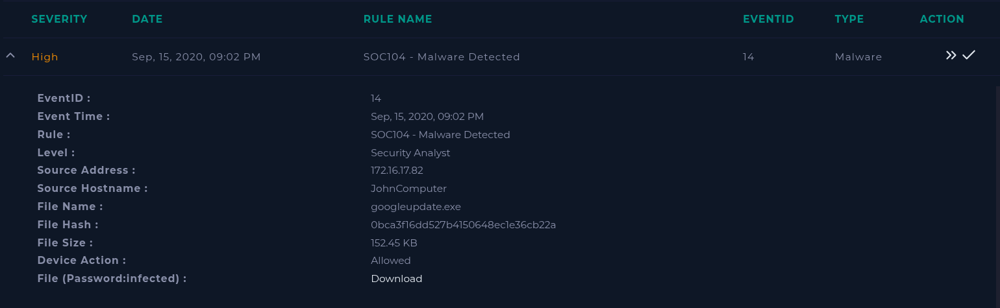<figcaption></figcaption></figure>

## ⚙️ 2. Start of Investigation

* Case created and playbook started.

<figure>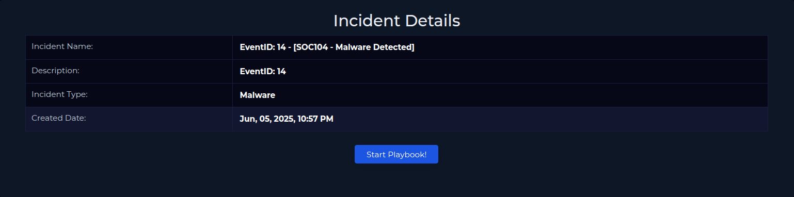<figcaption></figcaption></figure>

* Threat indicator set to "Other".

<figure>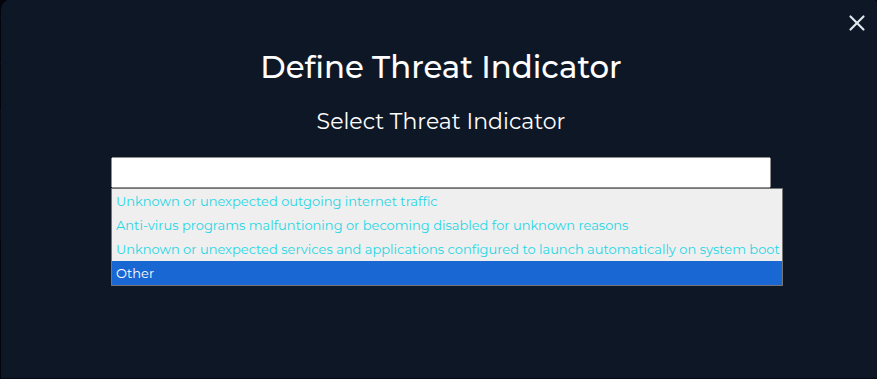<figcaption></figcaption></figure>

## 🧼 3. Quarantine Check

* The “Not Quarantined” field was marked based on the **Device Action (Allowed)**
* Manual inspection is required.

<figure>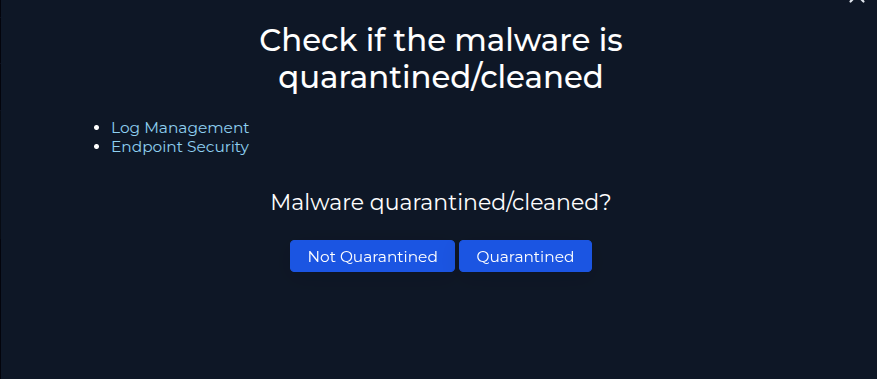<figcaption></figcaption></figure>

## 🧠 4. Malware Analysis

Before marking whether the malware was malicious or not, an analysis was done with third-party tools and C2 addresses

<figure>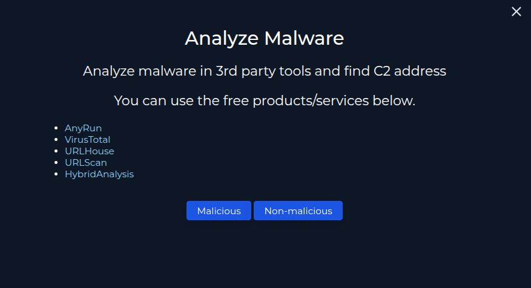<figcaption></figcaption></figure>

* **VirusTotal:** 0/72 engines flag as malicious.

<figure>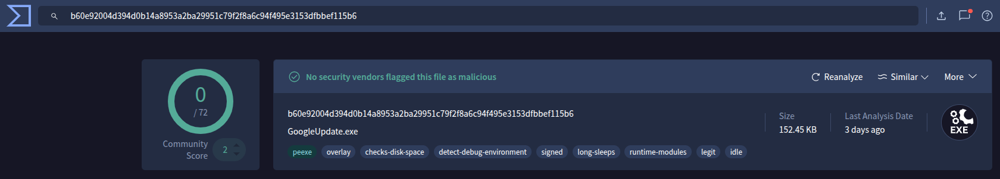<figcaption></figcaption></figure>

* **Hybrid Analysis:** Normal behavior, no persistence attempts or C2 connections.

<figure>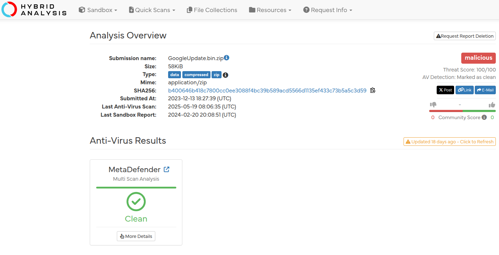<figcaption></figcaption></figure>

* **URLScan e URLhaus:** nothing malicious related to the hash or the source IP.

<figure>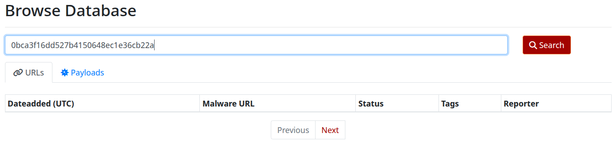<figcaption></figcaption></figure>

<figure>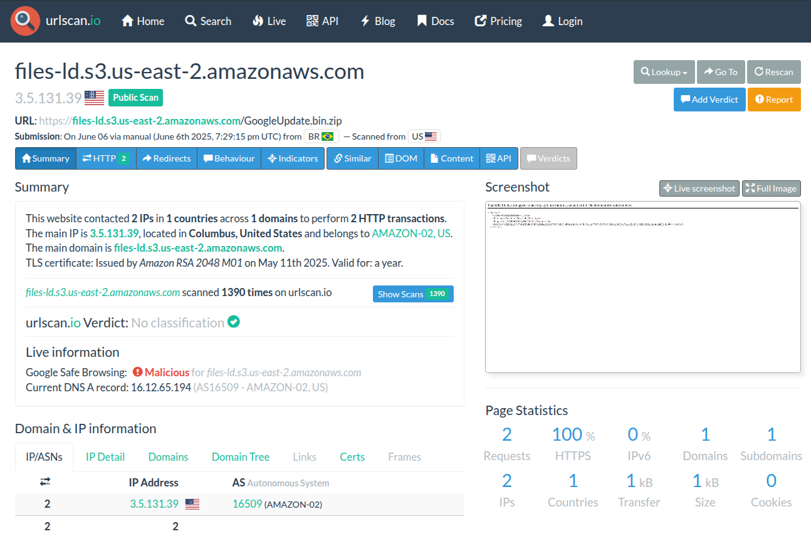<figcaption></figcaption></figure>

📌 Partial conclusion: so far, everything points to a **false positive**.

## 🔍 5. Process and Log Analysis

* Verified that the process was started by _**taskeng.exe**_ — typical of legitimate scheduled tasks.
* File location: `C:\Program Files (x86)\Google\Update\GoogleUpdate.exe`

<figure>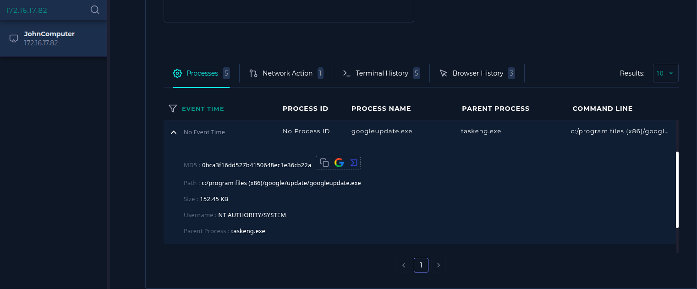<figcaption></figcaption></figure>

📌 Reinforces authenticity: location and process are consistent with expected Google updater behavior.

* Logs filtered by host IP

<figure>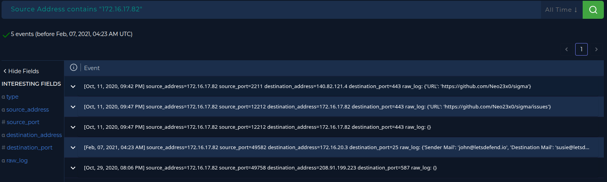<figcaption></figcaption></figure>

* Nothing anomalous detected in traffic during execution

<figure>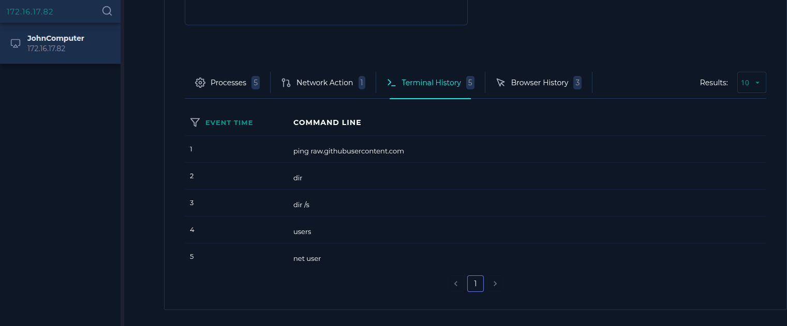<figcaption></figcaption></figure>

* Terminal and browser history consistent with normal use — no signs of malicious script execution.

<figure>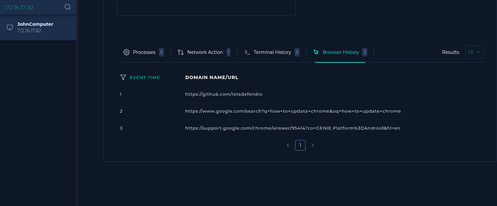<figcaption></figcaption></figure>

* &#x20;Since nothing was found to indicate that the file was malicious, it was marked as **Non-Malicious**.
* So we proceed with the Playbook

## 🧪 6. Artifact Collection

* File hash added as artifact.
* No malicious domains or IPs associated with the file.

<figure>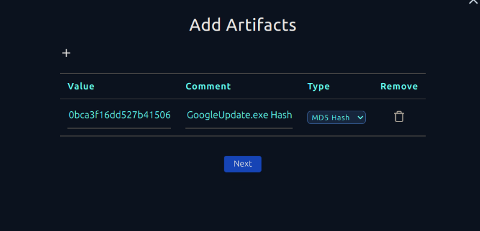<figcaption></figcaption></figure>

## ✅ 7. Conclusion

* Alert closed as false positive.
* No further action required on the endpoint.

<figure>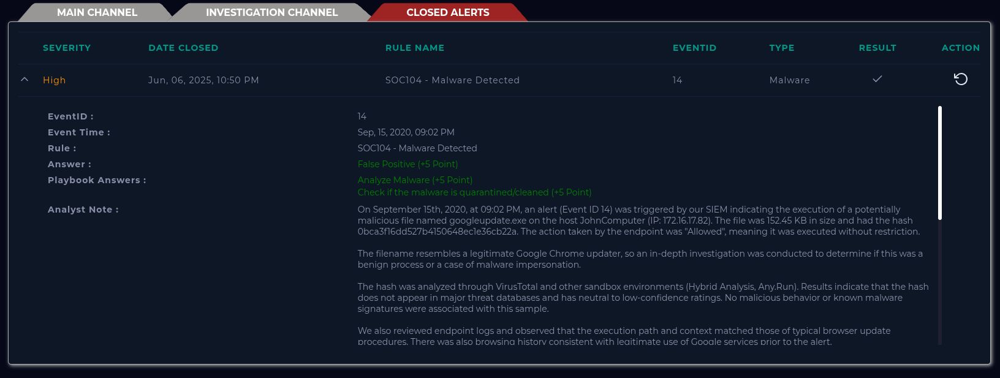<figcaption></figcaption></figure>

## 🔍 Analyst Note

At this time, there is no solid evidence that the file is malicious. It is likely a legitimate Chrome update process. However, as a precaution, it is recommended to confirm directly with the user whether they initiated an update around the alert time. If confirmed, this activity can be marked as benign and the file may be whitelisted to reduce false positives in the future.

If any unusual behavior is reported by the user or identified in follow-up logs, further investigation is advised.
